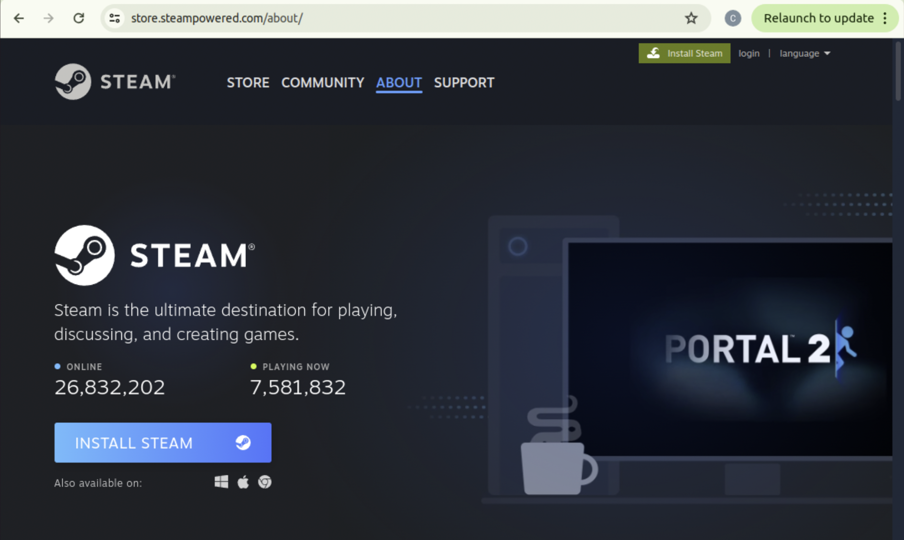

# Install Instructions


# 1- System Requirements

The objective of this section is to install the minimum system requirements: ubuntu dependencies, NVIDIA Driver, CUDA, and Conda. 


## Ubuntu Dependencies 

Install `LSF`: 

```
$ sudo apt-get install git-lfs 
$ git lfs install 
```

Install `libsdl2-dev`. This library allows the XR extension to load Steam:

```
$ sudo apt-get install libsdl2-dev 
```


## NVIDIA Driver

Make sure you have an NVIDIA Driver that is compatible with `CUDA 11.8`. CUDA 11.8 requires NVIDIA Driver >= 450.80.02. Check your nvidia driver with:

```
$ nvidia-smi 
```

Here is the Driver<>CUDA compatibility table:  
[https://docs.nvidia.com/deeplearning/cudnn/latest/reference/support-matrix.html](https://docs.nvidia.com/deeplearning/cudnn/latest/reference/support-matrix.html)

The recommended driver version for [Isaac Sim](https://docs.isaacsim.omniverse.nvidia.com/latest/installation/requirements.html) in Linux is 535.129.03.

If you need to change your driver version, the next section will include this step.


## CUDA

We currently use `CUDA 11.8`, which is compatible with `Isaac Sim 4.5`. 

You might have one or several versions of CUDA installed in your machine already. Check it in 
`/usr/local/`.

If you already have `cuda-11-.8`, skip the following step until ###source-cuda-paths

Otherwise, let’s install CUDA 11.8 (and NVIDIA driver if needed): 

Here are the instructions for all versions for reference, but we have the steps to follow below.  
[https://developer.nvidia.com/cuda-toolkit-archive](https://developer.nvidia.com/cuda-toolkit-archive)

For `CUDA 11.8` in `Ubuntu 22.04`, follow the instructions as follows:

```
$ wget https://developer.download.nvidia.com/compute/cuda/repos/ubuntu2204/x86_64/cuda-ubuntu2204.pin 
$ sudo mv cuda-ubuntu2204.pin /etc/apt/preferences.d/cuda-repository-pin-600 
$ wget https://developer.download.nvidia.com/compute/cuda/11.8.0/local_installers/cuda-repo-ubuntu2204-11-8-local_11.8.0-520.61.05-1_amd64.deb 
$ sudo dpkg -i cuda-repo-ubuntu2204-11-8-local_11.8.0-520.61.05-1_amd64.deb 
$ sudo cp /var/cuda-repo-ubuntu2204-11-8-local/cuda-*-keyring.gpg /usr/share/keyrings/ 
$ sudo apt-get update 
```

Now follow (1) OR (2):

**(1)** If you already have a compatible nvidia driver, and don’t wish to change it, run:

```
$ sudo apt-get install cuda-toolkit-11-8 
```

This should result in `CUDA 11.8` installed in `/usr/local`, and no NVIDIA driver change.

**(2)** If you want to install the default recommended NVIDIA driver for this CUDA version 

```
$ sudo apt-get -y install cuda 
```

This should result in `CUDA 11.8` installed in `/usr/local`, and NVIDIA driver `520.61.05` installed, for example.

### Source CUDA paths

After installing `CUDA 11.8`, source it if you have multiple CUDA versions installed:

``` 
export LD_LIBRARY_PATH=$(echo "$LD_LIBRARY_PATH" | tr ':' 'n' | grep -v "/usr/local/cuda-11.8/lib64" | tr 'n' ':' | sed 's/:$//') export PATH=$(echo "$PATH" | tr ':' 'n' | grep -v "/usr/local/cuda-11.8/bin" | tr 'n' ':' | sed 's/:$//') export PATH="/usr/local/cuda-11.8/bin:$PATH" export LD_LIBRARY_PATH="/usr/local/cuda-11.8/lib64:$LD_LIBRARY_PATH"
```

You can check which CUDA version you have active with:

```
$ nvcc --version
```

It should show the following:  

```
nvcc: NVIDIA (R) Cuda compiler driver  
Copyright (c) 2005-2022 NVIDIA Corporation  
Built on Wed_Sep_21_10:33:58_PDT_2022  
Cuda compilation tools, release 11.8, V11.8.89  
Build cuda_11.8.r11.8/compiler.31833905_0
```

**Note:** `nvcc --version` shows the installed and sourced CUDA version. The CUDA version shown in `nvidia-smi` is the version recommended for the installed driver, but not necessarily the version that is installed. 

---

## CONDA

Install Anaconda: 
[https://docs.anaconda.com/anaconda/install/linux/](https://docs.anaconda.com/anaconda/install/linux/)

```
$ wget https://repo.anaconda.com/archive/Anaconda3-2024.10-1-Linux-x86_64.sh
$ bash ~/Anaconda3-2024.10-1-Linux-x86_64.sh
(or other version)
```

Follow instructions in the terminal. 


# 2- VR Installation
The objective of this section is to install Steam, SteamVR, ALVR (if using a Quest headset) and verify a successful connection between SteamVR and the VR Headset/Controllers. 


## Install Steam and Steam VR

- Download Steam from [https://store.steampowered.com/about/](https://store.steampowered.com/about/) 

<p align="center">
    
</p>

- Launch the downloaded installer (debian) and follow instruction to install:

<p align="center">
    
</p>

- Launch Steam (click open). Follow instructions to finish the installation the first time you run Steam.  

- Use your existing account or create a new one.  

- Install Steam VR from within Steam

<p align="center">
    
</p>

- Launch Steam VR. The first time, it will request permissions:  

<p align="center">
    
</p>

- Patch steam VR: Steam VR frequently has an issue in Linux with lingering unnamed black windows that won’t close. Run this script for solving the issue:

```
$ collab-sim/config$ ./steamvr_black_window_ubuntu_fix.sh 
```

- If you reinstall steam vr, run this script again to patch the new installation.  

- Reboot. 


---

## VR HW

We have tested the system with Quest, HTC (2018 model), and Valve Index (with HTC controllers). 

### Quest 

Install [ALVR](https://github.com/alvr-org/ALVR) server (streamer) on your computer, and the ALVR app on your quest. Instructions [https://github.com/alvr-org/ALVR/wiki/Installation-guide](https://github.com/alvr-org/ALVR/wiki/Installation-guide).

Follow any steps required to configure the Quest HMD, such as setting the boundaries. 

Connect your Quest to the same Wifi network and the server computer (use 5GHz Wifi), or simply use a USB cable to connect the computer and the HMD. 

Activate developer mode on your Quest.


### Valve Index Headset - Linking to HTC controllers

The Valve Index is compatible with the XR Extension, but the models for the controllers are not available yet, so we relink the controllers to use the HTC controllers (blue model).

In order to link your Valve Index with the HTC controllers, launch Steam VR with the Valve Index, lighthouses (2.0), and controllers on, right click on the controllers and follow steps for relinking. 

The controllers will remain linked to the physical headset for future run without additional work. 

### HTC Vive (2018)

We have also tested the Vive HTC (2018 model), but this model is not available for purchasing it anymore. If you have it available already, it does work. 

Follow the SteamVR configuration steps on the HMD.

<p align="center">
    
</p>

---

## Run the VR-SteamVR connection 

Users should ensure a working connection between SteamVR and their VR hardware. To verify this, check that the SteamVR home environment is rendered in the headset (HMD), and the controllers are both visible and responsive. Additionally, the SteamVR window should display the HMD and controller icons in green, indicating they are connected and active. Use the following steps for this test. 

### Connect SteamVR (HTC and Index):  

Launch `Steam`, start `Steam VR`, and the HW should look active on the Steam VR panel, the VR HMD should be rendering the default steam VR home (top right window should display what's being rendered in the HMD), and the controllers movement be visible in the HMD. You might also try a Steam VR game as a test. 


<p align="center">
    
</p>

### Connect SteamVR with ALVR (Quest): 

Launch the ALVR server (streamer) and the ALVR app on the Quest headset, while connected to the same wifi network or using a USB cable. Launch SteamVR from ALVR, and verify the connection. 


---

# 3- VR in Isaac Sim 4.5  

The objective of this section is to install Isaac Sim, install the XR extension within Isaac Sim, and verify a successful connection between Isaac Sim and the VR headset through Steam VR.

## Install Isaac Sim 

### From pre-build binary: Preferred.   

Download the release Linux binary (zip file) from [https://docs.isaacsim.omniverse.nvidia.com/latest/installation/download.html](https://docs.isaacsim.omniverse.nvidia.com/latest/installation/download.html). 

Move to the directory where you will keep your Isaac Sim installation and unzip. Test launching Isaac Sim:

```
$ <your-path>/isaac-sim-standalone@4.5.0-rc.36+release.19112.f59b3005.gl.linux-x86_64.release$ ./isaac-sim.sh 
```

**Note:** The first time you launch the simulator it might be slow to start as it is building rendering elements. 

### From Launcher: 
You may download Isaac Sim from the Omniverse Launcher, but the Launcher will be discontinued, thus we are switching to the instructions above. 


## Install the XR extension in Isaac Sim

On Isaac Sim’s menu, click `Window`, then `Extensions`. It opens up the `Extensions Manager`. Search for `vr` and select `VR Experience`.

Enable the extension and check `Autoload`:

<p align="center">
    
</p>

That will also install the `SteamVR Input/Output`”` extension. 

Close the Extensions manager. 

Now the `VR tab` is shown on the GUI, click on it (bottom right).


<p align="center">
    
</p>


## Test the XR extension + Steam VR connection

We will now do a quick test to see that the XR extension on Isaac Sim runs and connects properly with Steam VR. 

- Add objects to the scene to do a quick test. For example, `Create --> Mesh --> Cube`, and `Create --> Environment --> Flat Grid`. 
- Run the [VR-SteamVR](##-run-the-vr-steamvr-connection) connection. The HMD should be rendering SteamVR Home and the controllers should be tracked.
- In the `VR Tab` in Isaac Sim, change the `Selected Output Plugin` from `OpenXR` to `SteamVR`, 

<p align="center">
    
</p>

- Click the `Start VR` button. 

The simulation environment should be rendered in the HMD (see Isaac Sim env matches VR view window), controllers should be tracked and responsive. 

<p align="center">
    
</p>


# 4- COLLAB-SIM Installation

The objective of this section is to create the `python environment` for `collab-sim`. It includes creating the `conda` env, installing `pytorch` and `curobo`, and sourcing `Isaac Sim` paths. We will use this conda env to run the `demos` in `collab-sim`. 

## Get the COLLAB-SIM repository

Clone `COLLAB_SIM`, and get the `LFS` content

```
$ git clone https://github.com/nvlabs/collab-sim  
$ cd collab-sim 
$ git lfs pull 
```

## Python Environment

We use conda to create a python env. 

```
$ conda create --name collab-sim python=3.10.15
$ conda activate collab-sim 
```


## PYTHONPATH

Make sure collab-sim is in your python path:

```
$ export PYTHONPATH="<your-path>/collab-sim":$PYTHONPATH 
```

## Install Curobo into this Conda Env

We use [Curobo](https://github.com/NVlabs/curobo) for MPC teleop and IK. 

Curobo install instructions are available here:  
[https://curobo.org/get_started/1_install_instructions.html](https://curobo.org/get_started/1_install_instructions.html)  

The following are the summarized instructions for our env:

```
(collab-sim)$ conda install pytorch==2.5.1  pytorch-cuda=11.8 -c pytorch -c nvidia
(collab-sim)$ git clone https://github.com/NVlabs/curobo.git
(collab-sim)$ cd curobo 
(collab-sim)$ pip install -e . --no-build-isolation  
This will take 20 minutes to install. 
$ pip install pytest $ python3 -m pytest .  #to verify that all unit tests pass. 
```

## Aditional pip dependencies

```
(collab-sim) $ pip install transforms3d
```

## Add Isaac Sim to this Conda Env

So far we have a conda env with the python dependencies for `collab-sim` and `curobo` installed. We now need to source `Isaac Sim` paths to be available from this conda env. 
This step allows collab-sim to see the `omni` package, for example.

```
(collab-sim) $ source <your-path>/isaac-sim-standalone@4.5.0-rc.36+release.19112.f59b3005.gl.linux-x86_64.release/setup_conda_env.sh 
```


Test the python env:

```
(collab-sim):~$ python
>>> import omni
>>> import curobo
>>> import collab_sim
>>> 
```

This conda env is used to run the examples in collab-sim: [Run instructions](/docs/run_docs.md)