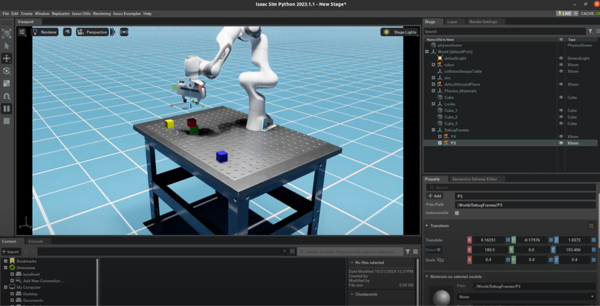
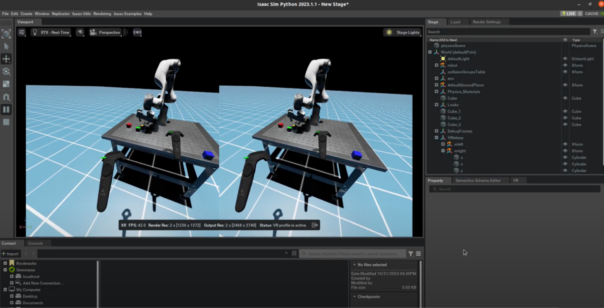
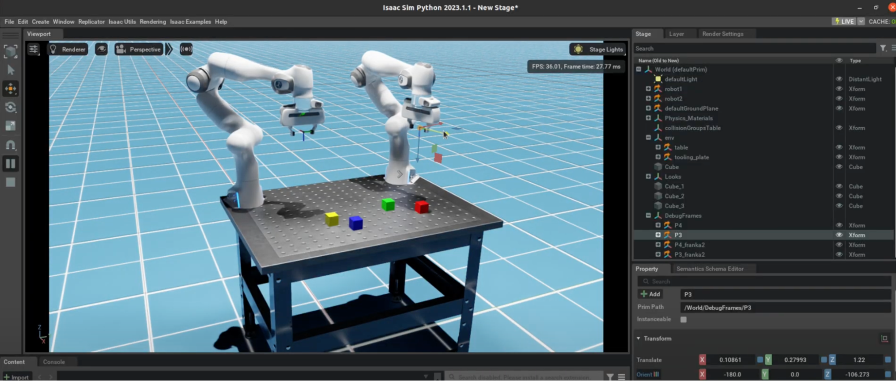
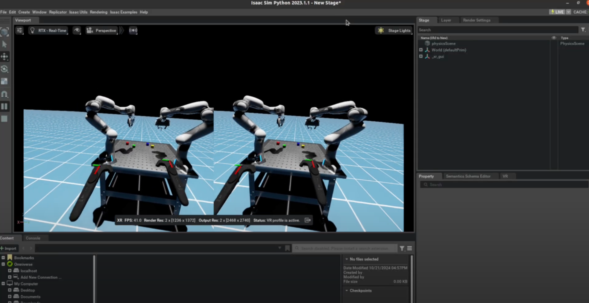
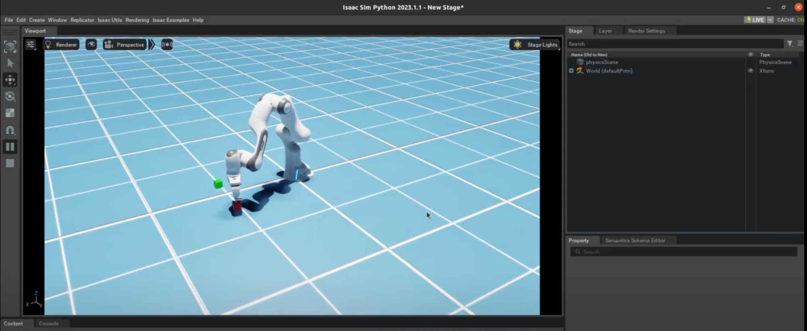

# COLLAB-SIM Running Instructions

We provide examples in `collab_sim/demos`. The examples can be run in VR mode or without VR (using mouse and keyboard teleop), making it easy to test even without a VR headset. This flexibility supports quicker iterations and faster development cycles.


---

- Start from a `conda` env that has `curobo` installed, `Isaac Sim` sourced, and `collab-sim` available. This process is shown in the [Installation instructions](/docs/install_docs.md). 


```
$ conda activate collab-sim 
(collab-sim) $ source <your-path>/isaac-sim-standalone@4.5.0-rc.36+release.19112.f59b3005.gl.linux-x86_64.release/setup_conda_env.sh 
(collab-sim) $ cd collab-sim/collab_sim 
```

- Run the example scripts on the conda env with the commands below. 


---

## Franka MPC teleop example [Script](https://github.com/NVlabs/collab-sim/blob/release/collab_sim/demos/franka_mpc_example.py) 

### Non VR:

```
(collab-sim) <>collab_sim$ python demos/franka_mpc_example.py
```


<p align="center">
    
</p>


### VR:

```
(collab-sim) <>collab_sim$ python demos/franka_mpc_example.py –-run_vr --enable omni.kit.xr.profile.vr --enable isaacsim.xr.openxr
```


<p align="center">
    
</p>


- Run the `VR-SteamVR` connection (shown in the install instructions). The HMD should be rendering SteamVR Home and the controllers should be tracking.

- The script launches `Isaac Sim` and loads the robot environment. Read the scripts for more information about their functionality. 

- In the `VR Tab` of `Isaac Sim`, change the `Selected Output Plugin` from `OpenXR` to `SteamVR`.

<p align="center">
    
</p>

- Click `Start VR`. 

- The robot's controller will load and start within a few seconds.

- Use the right controller's `trigger button` to activate the robot and start movement. The robot moves only while the trigger is pressed. Teleop 6DOF commands are relative to the controller's pose at the time of pressing, eliminating the need to pre-align the controller.

- Use the right controller's `side button` to control the gripper's open/close function.

- The left controller's `trigger button` resets the environment.

- The left controller’s `joystick` or trackpad teleports your view.

- Avoid pressing buttons while the controllers overlap with objects to prevent grabbing objects.


---

## Dual Franka example [script](https://github.com/NVlabs/collab-sim/blob/release/collab_sim/demos/dual_franka_mpc_teleop.py)

### Non VR:

```
(collab-sim) <>collab_sim$ python demos/dual_franka_mpc_teleop.py
```


<p align="center">
    
</p>

### VR:

```
(collab-sim) <>collab_sim$ python demos/dual_franka_mpc_teleop.py –-run_vr --enable omni.kit.xr.profile.vr --enable isaacsim.xr.openxr
```


<p align="center">
    
</p>

---

## Data replay example [Script](https://github.com/NVlabs/collab-sim/blob/release/collab_sim/replay_states.py) 

The repo includes an example data file with a short demo for replay. Users can run this without having the VR set up.

```
(collab-sim) <>collab-sim$ python replay_states.py
```

<p align="center">
    
</p>

